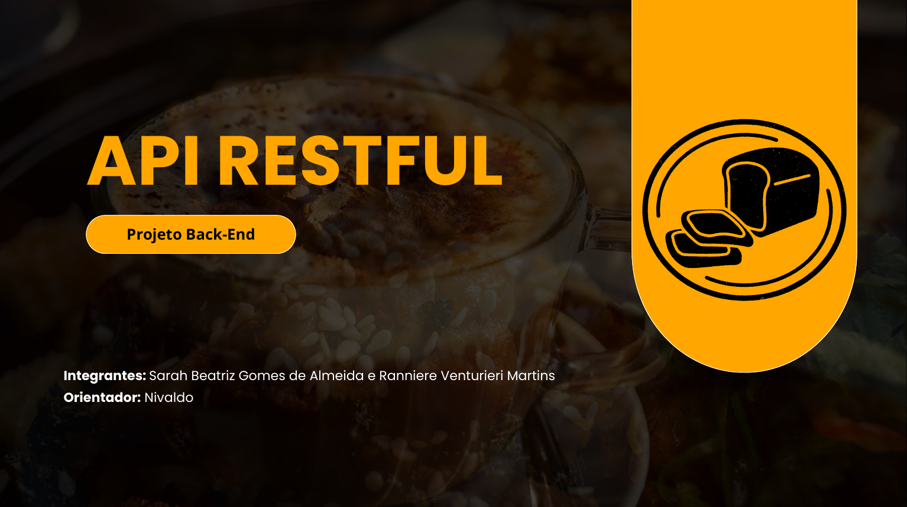
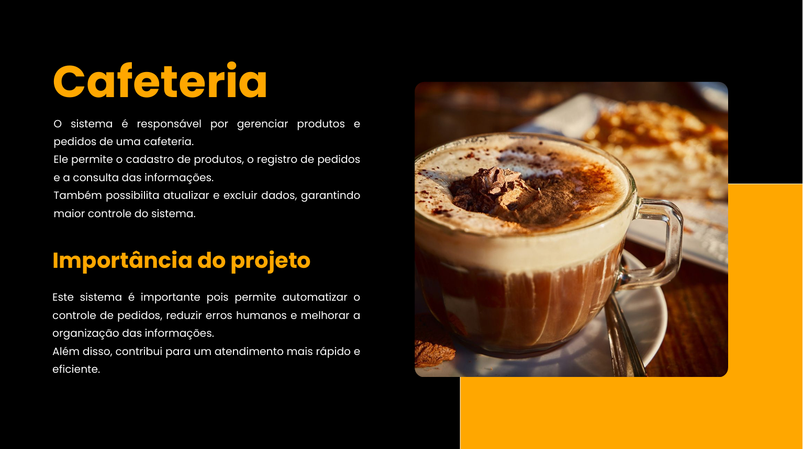
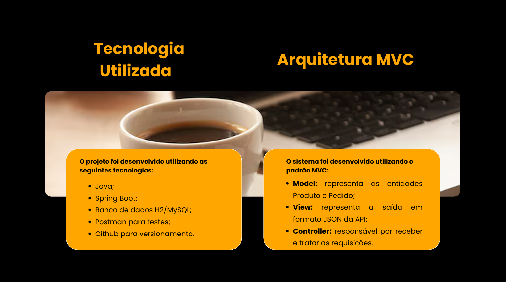
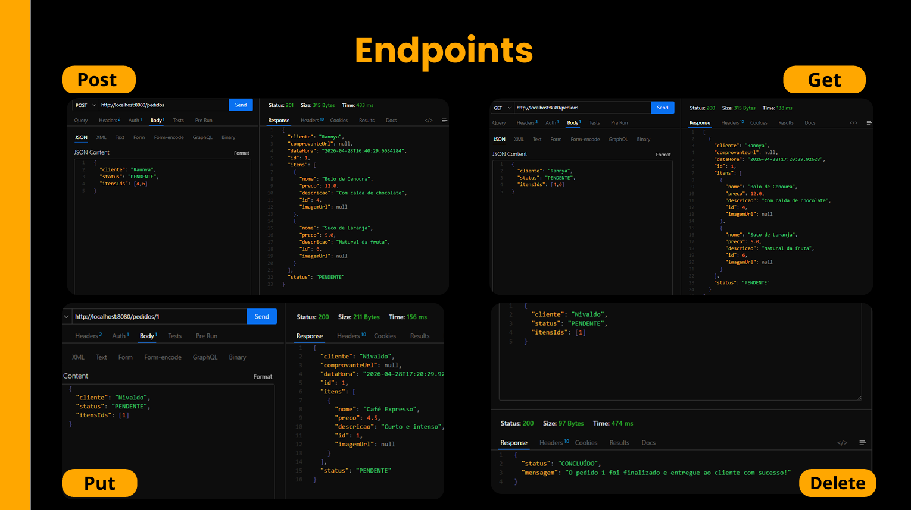
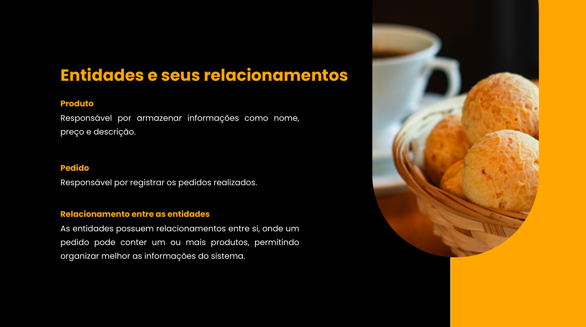
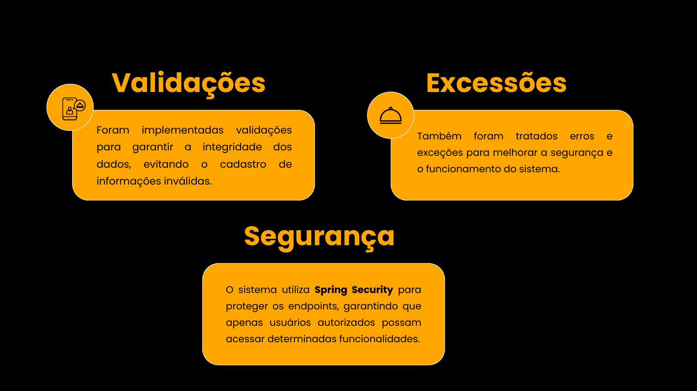
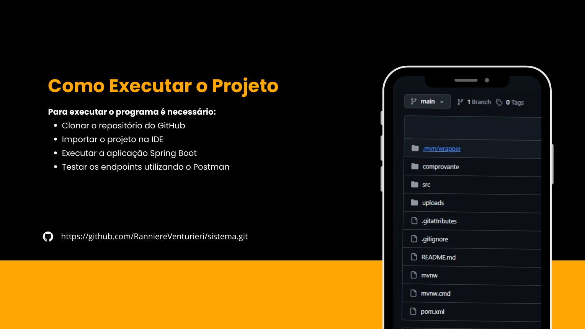
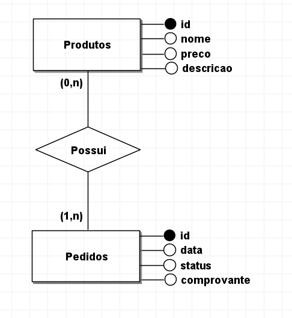
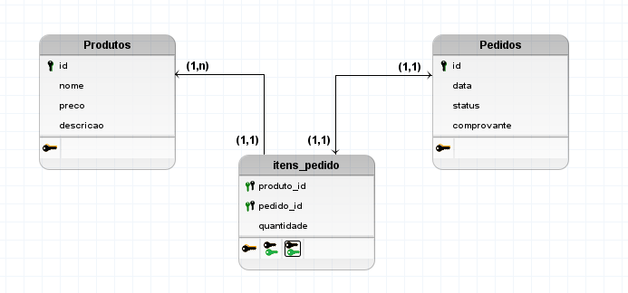

# ☕ Cafeteria System API

Sistema desenvolvido para gerenciamento de uma cafeteria, permitindo o controle de estoque de produtos e processamento de pedidos.

---

## 📺 Apresentação do Projeto (Pitch)

<details>
  <summary><b>✨ Clique aqui para expandir e ver os slides da apresentação do projeto</b></summary>
  
  <br>

  ### 1. Capa do Projeto
  

  ### 2. O Sistema e sua Importância
  

  ### 3. Arquitetura e Tecnologias (MVC)
  

  ### 4. Demonstração dos Endpoints (Postman)
  

  ### 5. Modelagem do Banco de Dados
  

  ### 6. Segurança e Validações
  

  ### 7. Como Executar
  

</details>

---
## 🗄️ Modelagem do Banco de Dados

Para garantir a integridade dos pedidos e dos produtos, a arquitetura do banco de dados foi desenhada seguindo as regras de negócio da cafeteria.

### Modelo Conceitual



---

### Modelo Lógico



---

## 🚀 Funcionalidades

* **Produtos:** Cadastro completo com imagem (armazenada localmente).
* **Pedidos:** Registro de vendas com múltiplos itens e cálculo automático.
* **Uploads:** Endpoints específicos para fotos de produtos e comprovantes de PIX.
* **Segurança:** Autenticação via Spring Security (Basic Auth).

---

## 🛠️ Tecnologias

* **Linguagem:** Java
* **Framework:** Spring Boot
* **Banco de Dados:** MySQL
* **ORM:** Hibernate / JPA

---

## 📋 Endpoints Principais

* **`GET` /produtos:** Lista todos os produtos.
* **`POST` /produtos:** Cadastra um novo produto.
* **`PUT` / `DELETE` /produtos:** Atualiza ou deleta um produto existente.
* **`POST` /produtos/{id}/upload:** Faz o upload da imagem do produto.

---

## 📁 Arquitetura MVC

```text
src/main/java/com/cafeteria/sistema/
├── entidades/    → Produtos, Pedidos, ItemPedido
├── repositories/ → Interfaces JPA
├── services/     → Lógica de negócio
├── controllers/  → Endpoints REST
├── exceptions/   → Exceções personalizadas
├── handler/      → Tratamento global de erros
└── config/       → Security

---

## 🔐 Configuração de Acesso

O sistema está protegido. Utilize as credenciais abaixo no **Thunder Client** ou no **Postman** (Auth -> Basic):

* **User:** `cafeteria`
* **Password:** `cafe`